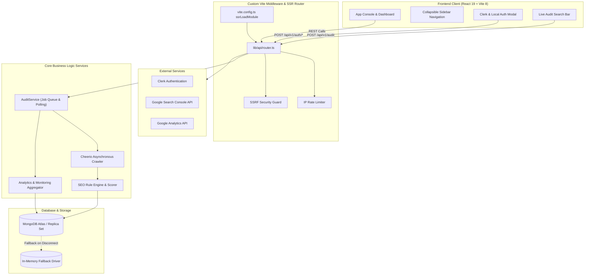

# GrowthSent 🚀

> **The calm command centre for the website you just shipped.**  
> Automated technical SEO audits, real-time indexability monitoring, and visitor analytics designed for modern web developers, solo founders, and indie hackers.

---

[](https://react.dev/)
[](https://vitejs.dev/)
[](https://tailwindcss.com/)
[](https://www.typescriptlang.org/)
[](https://www.mongodb.com/)
[](LICENSE)

---

## 📌 Executive Summary

Building and shipping web applications is faster than ever, but understanding whether search engines can discover, crawl, and rank your website remains fragmented across complex enterprise tools. **GrowthSent** eliminates the noise by providing a zero-setup, real-time website intelligence platform.

Simply paste any live web URL, and GrowthSent asynchronously crawls public HTML endpoints, identifies indexing barriers, evaluates technical SEO health, monitors HTTP uptime, and tracks performance trends — all within a dark-mode dashboard console.

---

## ✨ Key Features

### 🔍 1. Asynchronous Website Crawler & Audit Engine
- **Background Job Execution**: Non-blocking crawl pipeline handles multi-page websites without dropping HTTP response frames.
- **Cheerio HTML Parsing**: Extracts primary `<h1>` headings, `<title>` tags, `<meta name="description">` snippets, canonical links, `<meta name="robots">` indexing directives, and structured schema types.
- **SSRF Protection & URL Normalization**: Prevents Server-Side Request Forgery by enforcing protocol verification, private IP blacklisting, and host resolution guards.

### 🎯 2. Technical SEO Health & Score Computation
- **Algorithmic Health Score (0–100%)**: Weighted scoring algorithm evaluating indexability, document hierarchy, meta freshness, and response timing.
- **Rule-Based Issue Detection**: Classifies errors into `Critical`, `High`, `Medium/Warn`, and `Low` severity tiers.
- **Actionable Mitigation Prompts**: Provides contextual *"Why it matters"* explanations and *"How to fix"* recommendations tailored for developers.

### 🖥️ 3. Full-Screen Dashboard Console & Collapsible Navigation
- **Dynamic Site Selector**: Seamlessly switch between multiple registered domain properties.
- **Collapsible Sidebar**: One-click collapsible sidebar with vector SVG icons for every module view.
- **Responsive Centered Canvas**: Page views dynamically adjust layout math to stay centered and fill available display real estate.

### 📈 4. Web Visitor Analytics & Traffic Trends
- **Pageview & Visitor Metrics**: Aggregates unique visitor sessions, engaged duration, and bounce rates.
- **Interactive SVG Trend Charts**: Visualizes 7-day, 30-day, and 90-day traffic velocity curves.
- **Integration Readiness**: Supports direct stream tracking or optional Google Analytics data enrichment.

### 🔔 5. Automated Uptime & Indexability Alerts
- **Continuous HTTP Health Polling**: Monitors HTTP response codes (200 OK vs 4xx/5xx failures).
- **Robots & Meta Directive Monitoring**: Triggers instant alerts if pages accidentally deploy `noindex` or `nofollow` directives.

### 🔐 6. Secure Authentication System
- **Signed Session Cookies**: HttpOnly, SameSite cookies for server-rendered session validation.
- **Social OAuth Ready**: Integrated Clerk authentication supporting Google and GitHub sign-in flows.

---

## 🏗️ System Architecture



---

## 📁 Repository Structure

```
GrowthSent/
├── lib/                        # Backend Server Logic (Executed via Vite SSR)
│   ├── api/
│   │   └── router.ts           # Central API Router & Route Handlers
│   ├── auth/
│   │   ├── session.ts          # Session Token Generation & Cookie Management
│   │   ├── social.ts           # Google & GitHub OAuth Integration Helpers
│   │   └── user.ts             # User Profile & Password Hashing Services
│   ├── crawler/
│   │   └── crawler.ts          # Asynchronous Cheerio HTML Web Crawler
│   ├── db/
│   │   ├── mongodb.ts          # MongoDB Connection Driver with DNS Fallbacks
│   │   └── types.ts            # TypeScript Schemas & Document Interfaces
│   ├── integrations/
│   │   └── google.ts           # Google Search Console & Analytics Connectors
│   ├── security/
│   │   └── ssrf.ts             # Server-Side Request Forgery Defense Guards
│   └── services/
│       └── audit.service.ts    # Audit Job Queuing, Status Polling & Aggregation
├── src/                        # React 19 Frontend Application
│   ├── components/
│   │   └── dashboard/
│   │       ├── AppConsole.tsx  # Full Console Application State Shell
│   │       ├── Sidebar.tsx     # Collapsible Vector Icon Sidebar
│   │       ├── OverviewView.tsx# Dashboard Overview & Metrics Grid
│   │       ├── SeoAuditView.tsx# Technical SEO Audit & Actions Engine
│   │       ├── PagesView.tsx   # Crawled Pages Data Table & Inspector
│   │       ├── IssuesView.tsx  # Detailed Issue Mitigation Feed
│   │       ├── AnalyticsView.tsx# Visitor Traffic & Trend Charts
│   │       └── AlertsView.tsx  # Uptime & Automated Monitoring Log
│   ├── App.tsx                 # Root React Entrypoint & Auth Controller
│   ├── main.tsx                # React DOM Client Mount Shell
│   └── index.css               # Design Tokens, Utility Classes & Theme Rules
├── .env.example                # Template Environment Variables Configuration
├── package.json                # Project Dependencies & Vite Execution Scripts
├── vite.config.ts              # Vite 8 Server Configuration & Middleware Plugin
└── tsconfig.json               # TypeScript Compiler Configuration
```

---

## 🛠️ Tech Stack & Dependencies

| Category | Technology |
| :--- | :--- |
| **Frontend Framework** | React 19, React DOM 19 |
| **Build System & Dev Server** | Vite 8, `@vitejs/plugin-react` |
| **Styling & Design System** | Tailwind CSS v4, `@tailwindcss/vite`, Vanilla CSS Design Tokens |
| **Language** | TypeScript 5.7 |
| **Database** | MongoDB Atlas (Node.js MongoDB Driver v7) |
| **HTML Parsing & Crawling** | Cheerio v1.2 |
| **Authentication** | Custom Signed Session Cookies + `@clerk/clerk-react` |
| **Security & Validation** | Zod v4, SSRF IP Guards, Custom Rate Limiting |

---

## ⚡ Quickstart Guide

### Prerequisites
- **Node.js**: v18.0.0 or higher
- **pnpm** or **npm**

### 1. Clone the Repository
```bash
git clone https://github.com/kunalraha-ai/GrowthSent.git
cd GrowthSent
```

### 2. Install Dependencies
```bash
npm install
```

### 3. Configure Environment Variables
Create a `.env` file in the project root:
```bash
cp .env.example .env
```

Ensure your `.env` contains valid connection credentials:
```env
# MongoDB Connection String
MONGODB_URI=mongodb+srv://<username>:<password>@cluster0.example.mongodb.net/growthsent?retryWrites=true&w=majority

# Session Secret Key
SESSION_SECRET=your_super_secret_session_key_here

# Clerk Public & Secret Keys (Optional)
VITE_CLERK_PUBLISHABLE_KEY=pk_test_your_clerk_publishable_key
CLERK_SECRET_KEY=sk_test_your_clerk_secret_key
```

### 4. Start Development Server
```bash
npm run dev
```
Open your browser at `http://localhost:8443` to access GrowthSent.

---

## 📡 API Reference Endpoint Overview

| Method | Endpoint | Description | Auth Required |
| :--- | :--- | :--- | :---: |
| `POST` | `/api/v1/audit` | Triggers an asynchronous website crawl job | Optional |
| `GET` | `/api/v1/audit/:jobId` | Polls progress & retrieves complete scan results | Optional |
| `GET` | `/api/v1/websites` | Returns list of registered website properties | Yes |
| `POST` | `/api/v1/websites` | Registers a new website property for monitoring | Yes |
| `POST` | `/api/v1/auth/signup` | Registers a new user account | No |
| `POST` | `/api/v1/auth/login` | Authenticates user credentials & sets session cookie | No |
| `GET` | `/api/v1/auth/me` | Validates session token & returns user profile | No |
| `POST` | `/api/v1/auth/logout` | Revokes active session token & clears cookie | Yes |

---

## 🤝 Contributing

Contributions, feature requests, and bug reports are welcome!  
Feel free to open an issue or submit a pull request on [GitHub](https://github.com/kunalraha-ai/GrowthSent).

---

## 📜 License

Distributed under the MIT License. See `LICENSE` for more information.
