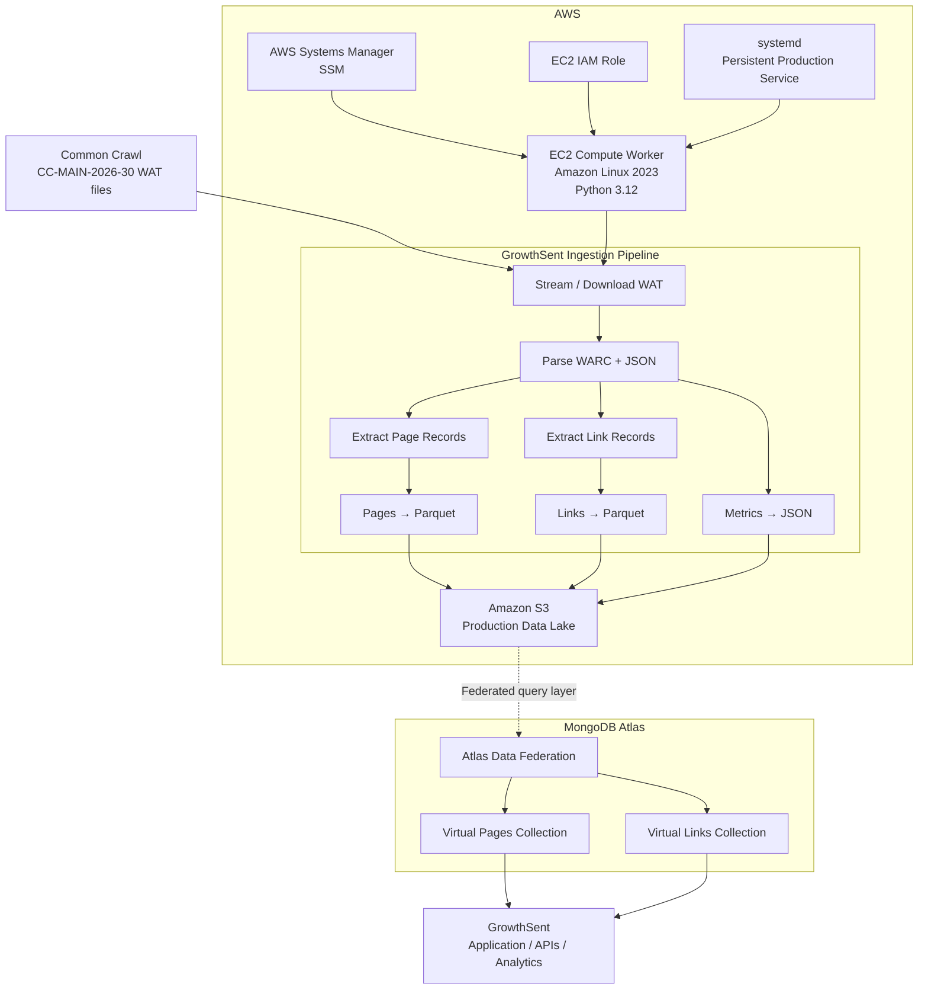
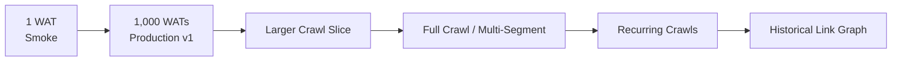
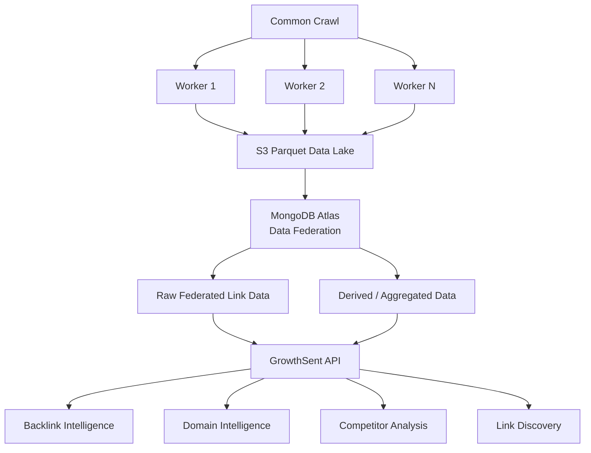

# GrowthSent

> Web-scale link intelligence infrastructure built on Common Crawl, AWS, Parquet, and MongoDB Atlas.

GrowthSent is building a production pipeline for transforming raw Common Crawl metadata into queryable web-link intelligence.

The system processes Common Crawl **WAT** files, extracts page and hyperlink relationships, converts the results into compressed analytical Parquet datasets, publishes those datasets to Amazon S3, and is designed to expose the resulting data through MongoDB Atlas Data Federation for application-level querying.

The first bounded production run processes exactly **1,000 WAT files** from:

```text
CC-MAIN-2026-30
```

This is intentionally a bounded production batch rather than an attempt to ingest the entire crawl immediately.

---

# Architecture



## Current production path

The currently running production pipeline is:

```text
Common Crawl
      │
      ▼
Common Crawl WAT
      │
      ▼
AWS EC2
      │
      ├── Parse WARC metadata
      ├── Extract pages
      ├── Extract hyperlinks
      └── Generate metrics
      │
      ▼
Apache Parquet
      │
      ▼
Amazon S3
```

The intended query architecture then continues:

```text
Amazon S3
      │
      ▼
MongoDB Atlas Data Federation
      │
      ├── Pages
      └── Links
      │
      ▼
GrowthSent
```

Atlas Data Federation is therefore **not performing the WAT ingestion**.

EC2 performs the ingestion and transformation.

Data Federation is the query layer over the resulting analytical data stored in S3.

---

# Why This Architecture?

Common Crawl is enormous.

Loading the raw crawl directly into a traditional application database would be unnecessarily expensive and operationally difficult.

GrowthSent instead separates the system into two major concerns:

### Compute plane

AWS EC2 performs CPU/network-intensive ingestion and transformation.

```text
WAT → parse → normalize → Parquet
```

### Storage and query plane

S3 provides inexpensive durable analytical storage.

MongoDB Atlas Data Federation can then provide a database-style interface over that object storage without requiring every raw link record to be copied into a normal MongoDB operational cluster.

Conceptually:

```text
             COMPUTE
                │
Common Crawl → EC2
                │
                ▼
             Parquet
                │
                ▼
              S3
                │
          ┌─────┴─────┐
          │ Federation │
          └─────┬─────┘
                │
             MongoDB
                │
                ▼
            GrowthSent
```

This separation allows compute, storage, and serving infrastructure to scale independently.

---

# Production Dataset

Current crawl:

```text
CC-MAIN-2026-30
```

Current production scope:

```text
1,000 WAT files
```

The production manifest is SHA-locked.

```text
6ce2c0c06612de9d8816d6075a25b15929209504f346305dae8ee9ced03b3b7a
```

The release bundle is also SHA-locked:

```text
4c7e2024efb593d688a927308db26e575d0ecd9d8b84ebf2cf4a000cfdb52b80
```

This ensures the production worker processes the exact approved release and exact approved set of inputs.

---

# Why Only 1,000 WAT Files?

The 1,000-file limit is deliberate.

GrowthSent is following a staged ingestion strategy:

```text
1 WAT
  │
  ▼
Smoke test
  │
  ▼
1,000 WATs
  │
  ▼
Production-v1 validation
  │
  ▼
Larger crawl scopes
  │
  ▼
Web-scale ingestion
```

Before increasing the crawl scope, the 1,000-WAT production run provides real measurements for:

- processing throughput
- pages extracted
- links extracted
- input/output compression
- EC2 runtime
- S3 storage requirements
- failure rates
- malformed Common Crawl records
- encoding repair rates
- cost per WAT
- resumability
- remote recovery
- query behavior

This prevents scaling an unverified ingestion pipeline directly to a much larger crawl.

---

# Smoke-Test Results

Before launching the 1,000-WAT production run, GrowthSent processed and verified one real WAT object.

Input:

```text
crawl-data/CC-MAIN-2026-30/segments/1783663951123.52/wat/CC-MAIN-20260710070534-20260710100534-00000.warc.wat.gz
```

Observed results:

| Metric | Result |
|---|---:|
| Input bytes | 157,991,429 |
| Records seen | 65,215 |
| Pages emitted | 21,738 |
| Links emitted | 3,031,891 |
| Output bytes | 84,953,355 |
| Runtime | 45.847 seconds |
| Malformed JSON | 0 |
| Malformed WARC | 0 |
| Malformed records | 5 |
| Encoding repairs | 1,360 |
| Reduction ratio | 0.462291 |

The smoke test successfully produced all three expected production objects:

```text
pages
links
metrics
```

and all three objects were subsequently verified from S3.

---

# S3 Layout

Production data is stored under:

```text
s3://growthsent-data-552648196041-us-east-1-an/
    production/
      common-crawl/
        wat-pages-links/
          v1/
            cc-main-2026-30-first-1000/
```

Data is partitioned by crawl and dataset.

```text
production/common-crawl/wat-pages-links/v1/
└── cc-main-2026-30-first-1000/
    └── crawl=CC-MAIN-2026-30/
        ├── dataset=pages/
        │   ├── part-....parquet
        │   └── ...
        │
        ├── dataset=links/
        │   ├── part-....parquet
        │   └── ...
        │
        └── dataset=metrics/
            ├── part-....json
            └── ...
```

Each successfully processed WAT produces a logical triplet:

```text
Pages Parquet
Links Parquet
Metrics JSON
```

For example, the verified smoke WAT produced:

```text
dataset=pages/part-a129b99c34135f0d.parquet

dataset=links/part-a129b99c34135f0d.parquet

dataset=metrics/part-a129b99c34135f0d.json
```

---

# Data Model

## Pages Dataset

The pages dataset represents pages observed in Common Crawl WAT metadata.

Conceptually:

```json
{
  "url": "https://example.com/page",
  "host": "example.com",
  "crawl": "CC-MAIN-2026-30"
}
```

The exact physical schema is defined by the ingestion implementation.

Pages are stored as Parquet for efficient analytical scanning and compression.

---

## Links Dataset

The links dataset represents hyperlinks extracted from pages.

Conceptually:

```json
{
  "source_url": "https://example.com/article",
  "target_url": "https://another-site.com/page",
  "source_host": "example.com",
  "target_host": "another-site.com",
  "crawl": "CC-MAIN-2026-30"
}
```

A single page may emit many link records.

This is why the link dataset is substantially larger than the page dataset.

The smoke WAT alone produced:

```text
21,738 pages
3,031,891 links
```

---

# MongoDB Atlas Data Federation

MongoDB Atlas Data Federation is intended to provide a database-style query interface over GrowthSent's S3 analytical datasets.

Instead of:

```text
S3 → import billions of rows → MongoDB cluster
```

the architecture can use:

```text
S3 Parquet
    │
    ▼
Atlas Data Federation
    │
    ▼
Virtual MongoDB collections
```

For example:

```text
S3 dataset=pages/
        │
        ▼
pages_2026_30
```

and:

```text
S3 dataset=links/
        │
        ▼
links_2026_30
```

Applications can then query the federated collections using MongoDB-style operations and aggregation pipelines.

Example conceptually:

```javascript
db.pages_2026_30.findOne()
```

or:

```javascript
db.links_2026_30.find({
    target_host: "example.com"
})
```

The exact production federation mappings should be treated as a separate deployment layer from ingestion.

---

# Example GrowthSent Query

A future backlink query can conceptually look like:

```text
User requests backlinks for example.com
                │
                ▼
          GrowthSent API
                │
                ▼
       MongoDB query layer
                │
                ▼
       Federated Links Data
                │
                ▼
             S3 Parquet
                │
                ▼
     matching source → target links
```

For example:

```javascript
db.links_2026_30.aggregate([
  {
    $match: {
      target_host: "example.com"
    }
  },
  {
    $group: {
      _id: "$source_host",
      links: { $sum: 1 }
    }
  },
  {
    $sort: {
      links: -1
    }
  }
])
```

This illustrates the intended query model; production query schemas and optimizations should follow the actual Parquet schema and federation configuration.

---

# EC2 Worker

The current worker runs on Amazon EC2 in:

```text
us-east-1
```

Operating system:

```text
Amazon Linux 2023
```

Runtime:

```text
Python 3.12
```

The production worker uses an EC2 IAM role:

```text
growthsent-commoncrawl-worker-role
```

The instance is managed remotely through AWS Systems Manager rather than requiring ordinary interactive SSH administration for the production workflow.

---

# AWS Systems Manager

AWS Systems Manager (SSM) is used as the operational control channel.

SSM is responsible for operations such as:

```text
deploy
validate
start
status
stop
resume
verify
```

The ingestion process itself does **not** depend on keeping the operator's local terminal connected.

Once launched, systemd owns the production process.

---

# systemd Production Service

Production ingestion runs as:

```text
growthsent-common-crawl-production-v1.service
```

This is important because the production job must survive:

- PowerShell closing
- SSM command completion
- operator disconnects
- local laptop sleep
- local network changes

The service is independent of the initiating terminal.

Expected running state:

```text
LoadState=loaded
ActiveState=active
SubState=running
```

---

# Production Controls

Production operations are managed through:

```text
deployment/common-crawl-production-v1/ssm-production-v1.ps1
```

## Start

```powershell
powershell -NoProfile -ExecutionPolicy Bypass `
  -File .\deployment\common-crawl-production-v1\ssm-production-v1.ps1 `
  -Action Start `
  -InstanceId <INSTANCE_ID> `
  -Region us-east-1
```

Do not issue `Start` again when the production service is already running.

---

## Status

```powershell
powershell -NoProfile -ExecutionPolicy Bypass `
  -File .\deployment\common-crawl-production-v1\ssm-production-v1.ps1 `
  -Action Status `
  -InstanceId <INSTANCE_ID> `
  -Region us-east-1
```

Status reports:

```text
systemd state
lifecycle state
ingestion progress
run summary
recent production logs
```

---

## Stop

```powershell
powershell -NoProfile -ExecutionPolicy Bypass `
  -File .\deployment\common-crawl-production-v1\ssm-production-v1.ps1 `
  -Action Stop `
  -InstanceId <INSTANCE_ID> `
  -Region us-east-1
```

The production service is configured for graceful interruption before systemd escalation.

---

## Resume

```powershell
powershell -NoProfile -ExecutionPolicy Bypass `
  -File .\deployment\common-crawl-production-v1\ssm-production-v1.ps1 `
  -Action Resume `
  -InstanceId <INSTANCE_ID> `
  -Region us-east-1
```

The ingestion pipeline is designed to resume rather than blindly reprocess successfully published work.

---

# Resume and Idempotency

Resumability is a core property of the ingestion architecture.

For each input, GrowthSent can determine whether the corresponding production objects already exist remotely.

Conceptually:

```text
Input WAT
   │
   ▼
Expected part ID
   │
   ▼
Check S3
   │
   ├── complete triplet exists
   │       │
   │       └── recover / skip
   │
   └── incomplete
           │
           └── process
```

The original smoke-test WAT demonstrated this behavior during the 1,000-WAT run.

The production process detected that its completed remote parts already existed and recovered that input instead of processing it again.

Initial production progress therefore correctly reported:

```text
files_completed: 1
files_remote_recovered: 1
files_not_successfully_completed: 999
```

This is expected behavior.

---

# Production Progress

Progress is persisted on the EC2 worker.

Important operational files include:

```text
/opt/growthsent/control/common-crawl-production-v1/production-v1.log

/opt/growthsent/control/common-crawl-production-v1/production-v1-status.json

/opt/growthsent/work/common-crawl-production-v1/control/run-progress.json

/opt/growthsent/work/common-crawl-production-v1/control/run-summary.json
```

A progress snapshot can contain metrics such as:

```json
{
  "total_inputs": 1000,
  "files_completed": 1,
  "files_failed": 0,
  "files_remote_recovered": 1,
  "files_not_successfully_completed": 999,
  "files_per_hour": 0.0,
  "estimated_remaining_seconds": null
}
```

Throughput and ETA become meaningful after enough fresh WATs have completed.

---

# Failure Handling

The production pipeline distinguishes successful completion from failed inputs.

Relevant metrics include:

```text
files_attempted
files_completed
files_failed
files_not_successfully_completed
files_remaining_to_attempt
```

A failed or interrupted run should be investigated and resumed rather than immediately restarted from scratch.

Because completed objects are persisted to S3, successfully published work does not need to be repeated.

---

# Local Disk Management

The production worker uses local EC2 disk as temporary working storage.

Successfully uploaded local artifacts can be removed after publication.

The durable source of truth for processed production output is S3.

Conceptually:

```text
WAT
 │
 ▼
EC2 temporary workspace
 │
 ├── pages.parquet ──┐
 ├── links.parquet ──┼──► S3
 └── metrics.json ───┘
          │
          ▼
 successful publication
          │
          ▼
 remove uploaded local artifacts
```

This prevents local disk consumption from increasing indefinitely as the crawl grows.

---

# Security Model

The worker follows a role-based AWS security model.

```text
Operator
   │
   │ SSM control
   ▼
EC2
   │
   │ IAM role
   ▼
S3
```

The EC2 instance receives AWS permissions through:

```text
growthsent-commoncrawl-worker-role
```

rather than requiring static AWS access keys to be embedded in the ingestion application.

The security group was designed around management through SSM and outbound HTTPS rather than exposing an application service on the worker.

---

# Dependency Lock

The production bundle pins major Python dependencies.

```text
pyarrow==19.0.1
boto3==1.43.67
botocore==1.43.67
s3transfer==0.19.2
jmespath==1.1.0
```

The worker runs these inside a Python 3.12 virtual environment.

---

# Production Bundle

The deployment bundle contains:

```text
BUNDLE-MANIFEST.json
requirements.txt
README.md

manifests/
  cc-main-2026-30-first-1000.json
  cc-main-2026-30-first-1000.paths

tools/
  common_crawl_wat_ingest.py
  common_crawl_v1_manifest.py
  verify_common_crawl_s3_objects.py
```

Release integrity is verified using SHA-256 before execution.

---

# Verification

The pipeline includes explicit S3 verification.

For a completed WAT, the verifier checks the expected triplet:

```text
dataset=pages
dataset=links
dataset=metrics
```

Verification includes checking the existing S3 objects rather than merely trusting that an ingestion process returned successfully.

The initial smoke-test triplet was independently verified after publication.

---

# Current Production State

At the beginning of the first 1,000-WAT production run:

```text
Crawl:
CC-MAIN-2026-30

Total locked inputs:
1000

Remote recovered:
1

Remaining after recovery:
999

Initial failures:
0
```

The recovered input is the previously verified smoke-test WAT.

The production service entered:

```text
ActiveState=active
SubState=running
```

and runs independently under systemd.

---

# Scaling Strategy

GrowthSent is intentionally designed to increase ingestion scope progressively.



Scaling is not simply a matter of increasing `--max-inputs`.

Before each major increase, the system should evaluate:

1. EC2 throughput
2. S3 output growth
3. Parquet partition sizing
4. federation scan behavior
5. query latency
6. query cost
7. failure rate
8. duplicate/recovery behavior
9. link normalization
10. domain-level aggregation strategy

At larger scale, parallel EC2 workers or another distributed compute model can be introduced without changing S3's role as the durable analytical layer.

---

# Long-Term Architecture

The eventual architecture can evolve toward:



At sufficient scale, GrowthSent does not necessarily need every user-facing request to scan raw link-level Parquet.

Frequently requested domain-level statistics can be precomputed or materialized into serving-oriented datasets.

That creates two complementary layers:

```text
Raw web graph
      │
      └── S3 + federation

Derived intelligence
      │
      └── optimized application/serving datasets
```

---

# What GrowthSent Is Building

The underlying asset is not simply a collection of Common Crawl files.

The pipeline transforms crawl metadata into a structured web graph:

```text
Page A ───────► Page B
   │
   ├──────────► Page C
   │
   └──────────► Page D
```

At domain level:

```text
example.com
    │
    ├── 428 links ──► company.com
    │
    ├── 112 links ──► competitor.com
    │
    └──  37 links ──► another.com
```

That graph can become the foundation for capabilities such as:

- backlink discovery
- referring-domain analysis
- competitor link analysis
- link intersection
- domain relationship analysis
- historical link discovery
- authority/importance signals
- prospect discovery
- link growth/loss tracking
- web graph analytics

Common Crawl supplies the raw observations.

GrowthSent's value comes from turning those observations into reliable, normalized, queryable, and eventually productized link intelligence.

---

# Repository Structure

A simplified repository layout:

```text
GrowthSent/
│
├── deployment/
│   └── common-crawl-production-v1/
│       ├── ssm-smoke-test.ps1
│       ├── ssm-verify-existing-smoke.ps1
│       └── ssm-production-v1.ps1
│
├── manifests/
│
├── tools/
│   ├── common_crawl_wat_ingest.py
│   ├── common_crawl_v1_manifest.py
│   └── verify_common_crawl_s3_objects.py
│
├── tests/
│
└── artifacts/
    └── common-crawl-production-v1-deployment/
```

---

# Operational Principles

GrowthSent's ingestion infrastructure follows several rules:

**Bound the scope.**  
Production runs operate against explicit manifests rather than accidentally consuming arbitrary crawl scope.

**Hash the scope.**  
Input manifests and deployment releases are cryptographically locked.

**Make work resumable.**  
A network interruption, SSM disconnect, or process restart should not require starting the entire crawl again.

**Persist before deleting.**  
Local output is removed only after successful publication.

**Verify production objects.**  
Successful process execution alone is not considered sufficient evidence that production data exists correctly.

**Separate compute from storage.**  
EC2 workers are replaceable. S3 is durable.

**Separate ingestion from querying.**  
The ingestion pipeline should not depend on the application query layer.

**Scale after measurement.**  
The 1,000-WAT production run establishes real operational characteristics before significantly larger ingestion.

---

# Technology Stack

| Layer | Technology |
|---|---|
| Raw web dataset | Common Crawl |
| Source format | WAT / WARC metadata |
| Compute | Amazon EC2 |
| Operating system | Amazon Linux 2023 |
| Runtime | Python 3.12 |
| Columnar processing | Apache Arrow / PyArrow |
| Analytical format | Apache Parquet |
| Object storage | Amazon S3 |
| AWS authentication | IAM Role |
| Remote operations | AWS Systems Manager |
| Process supervision | systemd |
| Federated query layer | MongoDB Atlas Data Federation |
| Application layer | GrowthSent |

---

# Status

### Completed

- Common Crawl WAT parser
- page extraction
- link extraction
- Parquet generation
- metrics generation
- S3 publication
- S3 object verification
- one-WAT smoke test
- remote resume/recovery
- SHA-locked 1,000-WAT manifest
- EC2 production worker
- IAM instance role
- SSM-based administration
- persistent systemd production service
- bounded production-v1 launch

### In progress

- 1,000-WAT `CC-MAIN-2026-30` production ingestion

### Next

- verify completed 1,000-WAT dataset
- measure actual throughput and storage
- inspect data quality
- connect/map the production S3 dataset through Atlas Data Federation
- validate real backlink/domain queries
- optimize Parquet/federation layout based on measured queries
- determine the next ingestion scope
- scale beyond the initial 1,000 WAT files

---

# Important Distinction

The current architecture should not be described as:

```text
Common Crawl → MongoDB
```

It is more accurately:

```text
Common Crawl
      │
      ▼
EC2 ingestion / transformation
      │
      ▼
Parquet
      │
      ▼
Amazon S3
      │
      ▼
MongoDB Atlas Data Federation
      │
      ▼
GrowthSent
```

Each layer has a different responsibility:

```text
Common Crawl = source

EC2         = compute

Parquet     = analytical representation

S3          = durable data lake

Data
Federation  = federated query interface

GrowthSent  = product and intelligence layer
```

---

# Vision

GrowthSent aims to transform open web crawl data into infrastructure for understanding relationships across the web.

The ingestion pipeline is only the foundation.

The progression is:

```text
Raw Crawl
    ↓
Structured Pages + Links
    ↓
Queryable Web Graph
    ↓
Domain Intelligence
    ↓
Backlink Intelligence
    ↓
GrowthSent
```

---

## License

Proprietary.

Copyright © GrowthSent. All rights reserved.
