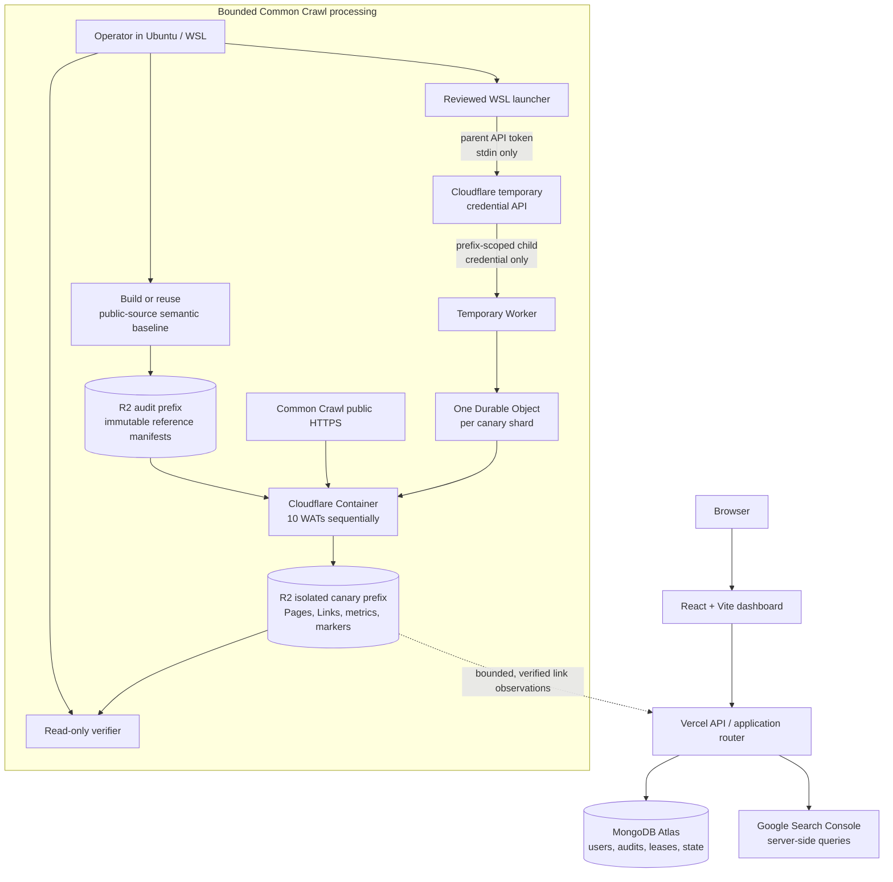

# GrowthSent

GrowthSent is a bounded, evidence-first SEO and search-intelligence application. It helps teams run technical audits, examine verified Google Search Console performance, and explore a clearly labelled Common Crawl link-observation preview.

It is deliberately designed to be credible before it is expansive: an audit only reports checks supported by collected evidence, and link data is never presented as a complete commercial backlink index.

## What GrowthSent does

- **Technical SEO audits** — durable, bounded crawls with evidence-backed page findings and explicit queued, crawling, analysing, complete, and failed states.
- **Search Intelligence** — Google Search Console views for clicks, impressions, CTR, average position, period comparisons, quick wins, content decay, CTR opportunities, potential cannibalisation, winners and losers, queries, and pages.
- **Backlink preview** — Common Crawl WAT anchor-link observations with exact-host lookup, external-link semantics, and a strict serving budget.
- **Operational safety** — durable MongoDB jobs, leases, heartbeats, retry backoff, crawl admission controls, and SSRF/origin protections.

## Product truthfulness

GrowthSent does not manufacture SEO facts or analytics.

- A pass/fail audit check appears only when the crawler persisted sufficient evidence.
- Failed or unfetched pages are never treated as indexable or as a successful audit.
- `robots.txt` and sitemap absence are reported only from confirmed HTTP-level evidence; fetch failures remain unavailable/not evaluated.
- Search Intelligence uses real GSC metrics only. It does not create search-volume, difficulty, traffic, authority, or AI-derived “fact” scores.
- Backlink data is raw Common Crawl link observation data—not a complete web index, authority score, traffic estimate, or total-backlink count.

## Architecture



The application and ingestion planes are deliberately separate. The public app uses MongoDB and Google Search Console through server-side APIs. The Common Crawl pipeline runs only as approved, isolated canaries; it never shares its short-lived storage credential with the app.

## Pipeline status

The historic 10K materials remain a bounded reference implementation, but its original golden raw artifacts are unavailable. New Cloudflare runs therefore use explicitly labelled **public-source semantic baselines**, not a claim of golden-artifact equivalence.

The current Cloudflare validation milestone is complete:

- 50 `CC-MAIN-2026-30` WATs were processed as five independent ten-WAT semantic-v2 shards.
- Every completed shard passed its exact 43-object R2 contract, full object integrity checks, semantic equivalence checks, and completion-marker-last validation.
- The temporary Workers used for those verified runs were retired; immutable R2 output remains preserved.

There is no approved 1,000- or 100,000-WAT production launch in this repository. The next stage requires Cloudflare confirmation of concurrent Container admission and account capacity; scale only through measured, approved batches.

## Repository layout

```text
src/                                  React dashboard
api/                                  Vercel function entrypoint
lib/                                  API, MongoDB, crawler, audit, GSC, and backlink services
tests/                                TypeScript and Python regression suites
tools/                                Common Crawl manifests, ingestion, verification, and derive tooling
deployment/common-crawl-production-v2/
                                      Proven bounded production-v2 release/runbook artifacts
deployment/common-crawl-gcp-r2-25k/  Local-only GCP → Cloudflare R2 25K canary preparation
deployment/common-crawl-cloudflare-r2-10-wat-canary/
                                      Reusable one-container, ten-WAT Cloudflare canary
deployment/common-crawl-cloudflare-r2-50-wat-canary/
                                      Five-shard baseline, verification, and Worker retirement helpers
```

## Local development

### Prerequisites

- Node.js 20.19+ and pnpm 11
- Python 3.12+ for Common Crawl tooling/tests

### Install and run

```bash
pnpm install
pnpm dev
```

The Vite application is then available through the local development URL.

### Validate

```bash
pnpm typecheck
pnpm test
pnpm build
python tests/common_crawl_wat_ingest.test.py
```

The cloud pipeline has additional focused Python tests under `tests/`. They are designed to run locally and do not require production credentials by default.

## Configuration and secrets

Copy `.env.example` to a local `.env` and populate only the services you are developing against. Never commit credentials, MongoDB URIs, cookies, OAuth tokens, AWS credentials, Cloudflare R2 credentials, or scheduler secrets.

Cloud-accessed pipeline code is designed around least-privilege, runtime-injected credentials. The GCP/R2 preparation uses Google Secret Manager as its planned secret-delivery boundary. Cloudflare parent API tokens are accepted only locally through hidden stdin prompts; they are never embedded in source, release bundles, Worker configuration, containers, R2, logs, or command arguments. Cloudflare Workers receive only short-lived child R2 credentials scoped to one fresh canary prefix.

Turnstile protects login and signup when configured. `VITE_TURNSTILE_SITE_KEY` is a public browser-side site key; `TURNSTILE_SECRET_KEY` is server-only and belongs in the Vercel environment, never in source control.

## Cloudflare canary runbook

The WSL-native canary workflow is intentionally bounded and explicit:

1. Prepare or reuse a local semantic-v2 baseline for an exact ten-WAT input set.
2. Publish the baseline to an isolated R2 audit prefix with its completion marker written last.
3. Run the reviewed launcher with an explicit approval flag. It verifies the baseline, mints a short-lived child R2 credential, and deploys one temporary Worker/Container pair.
4. The Container reads one WAT at a time over public HTTPS, validates semantic digests before publishing, and writes Pages, Links, metrics, and per-WAT completion objects to a fresh canary prefix.
5. Use the read-only verifier to check exact keys, SHA-256 metadata, full JSON hashes, semantic results, and completion-marker ordering.
6. Retire the temporary Worker only after verification. Do not remove immutable R2 output as part of routine cleanup.

Run Cloudflare deployment scripts only from Ubuntu/WSL with Docker available. They require a deliberate approval flag and never accept secrets as command-line arguments.

## Engineering principles

1. **Truth over presentation.** Missing evidence is not a pass.
2. **Bounded work.** Limits, leases, timeouts, queues, and retry ceilings protect users and infrastructure.
3. **Immutable data.** Deterministic keys, verified hashes, and completion markers make interruption and resume safe.
4. **Least privilege.** Application, crawler, analytics, and object-storage access stay narrowly scoped.
5. **Canary before scale.** A new platform or input window is proven on a small, isolated workload before ramping.

## Contributing

Keep changes focused and preserve existing safety contracts. Run the relevant local tests, typecheck, build, and `git diff --check` before opening a pull request. Do not deploy, alter cloud data, or widen cloud permissions as part of ordinary code changes.

## License

No license has been declared in this repository.
