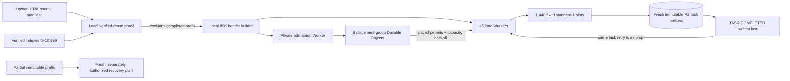

# Launch-disabled remaining-89K WAT self-recovery control plane

The final corpus contains 100,000 locked CC-MAIN-2026-30 WAT inputs. Earlier
immutable, read-only verification proves that source indexes `0..10,999` are
already complete: the merged 10,000-WAT result plus the completed 1,000-WAT
shard-10 checkpoint and recovery. This control plane processes **only** global
source indexes `11,000..99,999` — exactly 89,000 WATs.

## Reuse boundary

This is **not** a generic "start from WAT 0" 89K pipeline. Its builder and
runtime enforce the `11,000..99,999` source window and require the verified
reuse proof for indexes `0..10,999`. You can reuse it directly only for the
same remaining window after that proof is available. To process a fresh 89K
selection from index 0, build a new campaign plan with the intended source
range and an empty reuse set; to process all 100K from scratch, use a separate
all-input plan and validate it through the same local gate before launch.



Each lane owns a deterministic sparse slice of the remaining global window.
The coordinator and the Container-side runner both receive
`GROWTHSENT_SOURCE_INDEX_START=11000`; they reject a task outside their own
global slice. This makes a rerun of the verified 11K impossible by
configuration, not convention.

## 24-hour planning envelope

The prepared topology is 45 lanes × 32 fixed `standard-1` slots = 1,440
maximum active Containers and 1,440 maximum reserved instances. Its six shared placement groups serialize cold
starts at six-second intervals and use bounded capacity backoff, avoiding the
previous regional pre-warmed-pool burst. At 62 waves per lane, a 20-minute P95
WAT duration, 26.7 minutes of cold-start admission, and two hours of isolated
recovery headroom, the planned wall time is 83,200 seconds (23.1 hours).

This is an operating envelope, not a guarantee. Cloudflare's published account
limits cover 1,440 `standard-1` instances, leaving 384 GiB of memory headroom;
the staged admission and recovery
controls remain necessary because those limits do not eliminate transient
regional pool allocation failures or create a start-rate reservation.

## Lane-local failure handling

The coordinator retries an interrupted task subprocess (`SIGTERM`, exit
`-15`) in its fixed lane queue: the absence of `TASK-COMPLETED.json` makes the
retry safe. If a task has already published one immutable payload and a retry
observes a destination conflict, it is quarantined rather than overwritten;
that lane continues with its remaining WATs. Once the lane is terminal, the
quarantined source identities are recovered in a fresh prefix and included in
the final completion-marker aggregate.

The operator-only `resume-final-89k-failed-lane-wsl.sh` tool is restricted to
one explicitly named terminal lane. It deploys the recovery behavior only to
that lane and accepts only these two diagnosed conditions. It never deploys,
stops, or reconfigures a sibling lane.

## Local final gate

The gate needs the secret-free artifacts from the verified runs. It only reads
them, derives a new local proof, builds the bundles, runs contract tests, builds
one representative Docker image, and performs Wrangler dry-runs. It cannot
call Cloudflare, mint credentials, write R2, deploy, or start a Container.

```bash
GROWTHSENT_FIRST_TEN_THOUSAND_AGGREGATE_CONTRACT=/tmp/.../AGGREGATE-RECOVERY-CONTRACT.json \
GROWTHSENT_SHARD_TEN_RECOVERY_CONTRACT=/tmp/.../RECOVERY-CONTRACT.json \
GROWTHSENT_SHARD_TEN_RECOVERY_CONTEXT=/tmp/.../HIGH-CAPACITY-PARTIAL-RECOVERY-CONTEXT.json \
GROWTHSENT_SHARD_TEN_RECOVERY_REPORT=/tmp/.../VERIFICATION-REPORT.json \
bash deployment/common-crawl-cloudflare-r2-standard1-hundred-thousand-self-recovery/compile-final-89k-gate-wsl.sh
```

The generated `SELF-RECOVERY-RUN-PLAN.json` remains explicitly launch-disabled.
A future launch requires a separately reviewed provisioner, a fresh R2 root,
six-day lane-scoped child credentials and explicit user
approval. The parent credential is never installed in a Worker or Container.

## Terminal-run recovery

If a final campaign reaches a terminal state with recoverable failures, do not
rerun its original launcher. The recovery launcher first proves every original
lane is inactive, lists the original R2 root with a read-only child credential,
and validates every `TASK-COMPLETED.json` against the original source key,
lane, and immutable selected-input binding. It creates a fresh recovery plan
only for source identities with no valid completion marker.

The original campaign root is never writable during this operation. Recovery
outputs use a new `cloudflare-r2-final-recoveries` root and fresh lane-scoped
write-only child credentials.

```bash
GROWTHSENT_FINAL_89K_RECOVERY_SOURCE_CONTEXT=/tmp/.../FINAL-89K-RUN-CONTEXT.json \
bash deployment/common-crawl-cloudflare-r2-standard1-hundred-thousand-self-recovery/recover-final-89k-wsl.sh \
  --approved-final-89k-recovery
```

If the inventory finds zero missing identities, it exits before any Worker or
Container deployment. Otherwise, it locally builds and dry-runs a recovery
bundle before deploying fresh recovery Workers. It never stops, deploys over,
or reconfigures the original lanes.

If the read-only inventory and local bundle build have already passed but the
provisioner fails **before it requests a parent token, mints a child
credential, or preflights a recovery prefix**, use the prepared-plan resume
tool rather than repeating the large marker inventory. It validates the plan
and its immutable contract locally, performs one representative local dry-run,
then retains the normal fresh-prefix preflights before deployment:

```bash
GROWTHSENT_FINAL_89K_RECOVERY_PLAN=/tmp/.../bundle/FINAL-89K-RECOVERY-RUN-PLAN.json \
bash deployment/common-crawl-cloudflare-r2-standard1-hundred-thousand-self-recovery/resume-final-89k-recovery-wsl.sh \
  --approved-final-89k-recovery-provision
```

Use this only when the prior safe output explicitly established that no
credential mint, R2 preflight, Worker deployment, or Container start occurred.

### Capacity-neutral recovery after a quota-only deployment rejection

The account memory envelope is reserved by a Container application's
`max_instances`, not only by running Containers. If a prior final campaign is
terminal, a small recovery that creates additional 32-slot applications can be
rejected even though its task count is tiny. When the prepared recovery's
APAC-01 Worker was deployed but explicitly never started, the following tool
rebuilds the exact missing source identities into that existing 32-slot
application. It updates **only** APAC-01, retains its reservation, and leaves
the original campaign, completed output, and sibling recovery Workers alone.

```bash
GROWTHSENT_FINAL_89K_RECOVERY_PLAN=/tmp/.../bundle/FINAL-89K-RECOVERY-RUN-PLAN.json \
bash deployment/common-crawl-cloudflare-r2-standard1-hundred-thousand-self-recovery/consolidate-final-89k-recovery-wsl.sh \
  --approved-final-89k-capacity-neutral-recovery
```

The tool refuses any source plan that does not prove APAC-01 is the reviewed
32-slot pre-start target. It still performs a fresh-prefix R2 preflight before
the one updated Worker can receive a start request.
