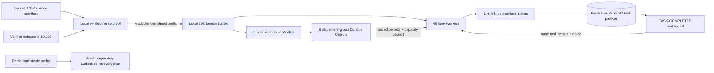

# Launch-disabled remaining-89K WAT self-recovery control plane

The final corpus contains 100,000 locked CC-MAIN-2026-30 WAT inputs. Earlier
immutable, read-only verification proves that source indexes `0..10,999` are
already complete: the merged 10,000-WAT result plus the completed 1,000-WAT
shard-10 checkpoint and recovery. This control plane processes **only** global
source indexes `11,000..99,999` — exactly 89,000 WATs.

## Reuse boundary

This is **not** a generic "start from WAT 0" 89K pipeline. Its builder and
runtime enforce the `11,000..99,999` source window and require the verified
reuse proof for indexes `0..10,999`. You can reuse it directly only for the
same remaining window after that proof is available. To process a fresh 89K
selection from index 0, build a new campaign plan with the intended source
range and an empty reuse set; to process all 100K from scratch, use a separate
all-input plan and validate it through the same local gate before launch.



Each lane owns a deterministic sparse slice of the remaining global window.
The coordinator and the Container-side runner both receive
`GROWTHSENT_SOURCE_INDEX_START=11000`; they reject a task outside their own
global slice. This makes a rerun of the verified 11K impossible by
configuration, not convention.

## 24-hour planning envelope

The prepared topology is 45 lanes × 32 fixed `standard-1` slots = 1,440
maximum active Containers and 1,440 maximum reserved instances. Its six shared placement groups serialize cold
starts at six-second intervals and use bounded capacity backoff, avoiding the
previous regional pre-warmed-pool burst. At 62 waves per lane, a 20-minute P95
WAT duration, 26.7 minutes of cold-start admission, and two hours of isolated
recovery headroom, the planned wall time is 83,200 seconds (23.1 hours).

This is an operating envelope, not a guarantee. Cloudflare's published account
limits cover 1,440 `standard-1` instances, leaving 384 GiB of memory headroom;
the staged admission and recovery
controls remain necessary because those limits do not eliminate transient
regional pool allocation failures or create a start-rate reservation.

## Local final gate

The gate needs the secret-free artifacts from the verified runs. It only reads
them, derives a new local proof, builds the bundles, runs contract tests, builds
one representative Docker image, and performs Wrangler dry-runs. It cannot
call Cloudflare, mint credentials, write R2, deploy, or start a Container.

```bash
GROWTHSENT_FIRST_TEN_THOUSAND_AGGREGATE_CONTRACT=/tmp/.../AGGREGATE-RECOVERY-CONTRACT.json \
GROWTHSENT_SHARD_TEN_RECOVERY_CONTRACT=/tmp/.../RECOVERY-CONTRACT.json \
GROWTHSENT_SHARD_TEN_RECOVERY_CONTEXT=/tmp/.../HIGH-CAPACITY-PARTIAL-RECOVERY-CONTEXT.json \
GROWTHSENT_SHARD_TEN_RECOVERY_REPORT=/tmp/.../VERIFICATION-REPORT.json \
bash deployment/common-crawl-cloudflare-r2-standard1-hundred-thousand-self-recovery/compile-final-89k-gate-wsl.sh
```

The generated `SELF-RECOVERY-RUN-PLAN.json` remains explicitly launch-disabled.
A future launch requires a separately reviewed provisioner, a fresh R2 root,
six-day lane-scoped child credentials and explicit user
approval. The parent credential is never installed in a Worker or Container.
