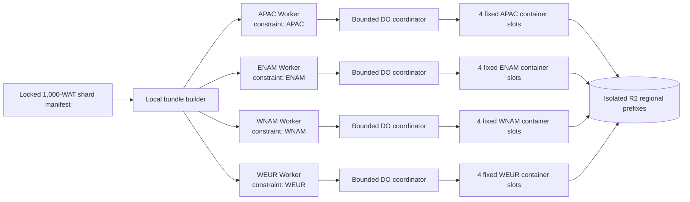

# Regional standard-1 WAT ramp

This is the scale-up replacement for the failed single-region ten-way test. It
uses the locked `cc-main-2026-30-first-100000` v2 shard manifest and distributes
one-WAT Container jobs across four separate, region-constrained Workers.



Each lane owns every fourth WAT (task_index % 4). Its Durable Object starts at
most one new task per spacing interval and never exceeds a configured
four-task in-flight limit. The coordinator maps those jobs onto four stable
Container Durable Object slot identities. Each slot runs a private loopback
HTTP runner which executes one WAT child process at a time, then remains alive
for its next task. This amortises cold starts and prevents a new Container
allocation for every WAT.

If a Container is interrupted after publishing only a task's identity-bound
`TASK-INPUT-MANIFEST.json`, the next attempt re-verifies that manifest and
resumes safely. If any later immutable payload exists without the final
`TASK-COMPLETED.json` marker, that task is quarantined for an isolated fresh
recovery prefix while its lane continues processing the remaining WATs. This
never overwrites partial evidence or lets one interrupted task halt an entire
batch.

The scheduler retries transient allocation loss (including
NO_CONTAINER_AVAILABLE and max_instances races) with bounded exponential
backoff instead of marking the whole lane failed. It records the slot with each
in-flight task; an interrupted task can safely be retried because the
task-specific immutable R2 completion marker is written last and the runner
recognises an already-completed task as a reuse. The status endpoint reads only
the at-most-four active slots; it never fans out across every historical task.

The first recommended remote capacity run is 50 WATs: four lanes, four active
Containers per lane, a 15-second start spacing, and `max_instances: 6` per
Worker. The same topology has now completed a verified 50-WAT run and a
100-WAT run plus its isolated 18-WAT ENAM recovery.

The R2 credential model is deliberately regional rather than per-WAT. Capacity
checkpoints use a two-hour credential; the separately gated 1,000-WAT profile
uses a six-day credential, still scoped write-only to one fresh regional prefix
per Worker. Its coordinator refuses a new task during the credential's final
three hours, so no WAT is deliberately started without enough time to finish
within the 110-minute task limit. All writes remain immutable and the runner
itself uses a task-specific child prefix. This avoids placing thousands of
independent credentials in Worker secrets while keeping all production prefixes
out of scope.

Run the local-only gate in WSL:

```bash
bash deployment/common-crawl-cloudflare-r2-standard1-regional-ramp/compile-gate-wsl.sh
```

Set `GROWTHSENT_REGIONAL_RAMP_TASK_COUNT=1000` only to compile a generic full
locked plan. The script has no remote deployment or start path.

After a separate approval, the guarded capacity launcher accepts only 50 to
100 WATs, not 1,000:

```bash
bash deployment/common-crawl-cloudflare-r2-standard1-regional-ramp/provision-and-start-wsl.sh \
  --approved-regional-capacity-run
```

It mints one short-lived R2 credential per regional prefix, preflights all four
prefixes before deploying any Worker, and starts each lane only after all four
Workers are ready. Verify the completed run before deciding on the 1,000-WAT
launch:

```bash
bash deployment/common-crawl-cloudflare-r2-standard1-regional-ramp/verify-regional-ramp-wsl.sh \
  --context /tmp/.../bundle/REGIONAL-RAMP-CONTEXT.json
```

If a launch is confirmed to have accepted zero tasks, retire its four temporary
Workers before using a fresh run ID. This sends only the required v2 Durable
Object deletion migration; it never contacts R2:

```bash
bash deployment/common-crawl-cloudflare-r2-standard1-regional-ramp/retire-regional-workers-wsl.sh \
  --approved-retire-run <run-id>
```

## Controlled 1,000-WAT stage

The dedicated local gate fixes the 1,000-task profile: 250 locked WATs per
region, four active `standard-1` Containers per Worker (16 total), a
15-second lane spacing, six-day prefix-scoped R2 child credentials, and a
three-hour credential-expiry start guard. The read-only verifier paginates R2
listings because each regional lane produces 1,750 immutable objects.

First run the local-only compile/Docker/Wrangler gate:

```bash
bash deployment/common-crawl-cloudflare-r2-standard1-regional-ramp/compile-thousand-wat-gate-wsl.sh
```

After that gate passes and a separate remote-start approval is given, launch one
fresh isolated 1,000-WAT run:

```bash
bash deployment/common-crawl-cloudflare-r2-standard1-regional-ramp/provision-and-start-thousand-wat-wsl.sh \
  --approved-thousand-wat-run
```

The local terminal is only used for bundle creation and the start request; the
actual WAT work runs remotely, so it is safe to close the laptop after a
`live_regional_capacity_run_accepted` response. When all four regional lanes
finish, verify their full seven-object-per-task R2 contracts with the existing
read-only verifier:

```bash
bash deployment/common-crawl-cloudflare-r2-standard1-regional-ramp/verify-regional-ramp-wsl.sh \
  --context /tmp/.../bundle/REGIONAL-RAMP-CONTEXT.json
```

## Controlled 10,000-WAT stage

The 10,000-WAT stage preserves the verified execution topology rather than
increasing the cold-start burst: four regional Workers, four long-lived
`standard-1` slots per Worker, and 15-second lane spacing. Each lane owns
exactly 2,500 WATs, for a maximum of 16 active Containers. The 10,000-WAT base
manifest is the immutable `cc-main-2026-30-first-10000` input set.

Run the local-only build, Docker contract suite, and four Wrangler dry-runs
first. It makes no Cloudflare API call and creates no remote resource:

```bash
bash deployment/common-crawl-cloudflare-r2-standard1-regional-ramp/compile-ten-thousand-wat-gate-wsl.sh
```

Only after that succeeds and a separate remote-start approval is given, launch
one fresh prefix-scoped 10,000-WAT run:

```bash
bash deployment/common-crawl-cloudflare-r2-standard1-regional-ramp/provision-and-start-ten-thousand-wat-wsl.sh \
  --approved-ten-thousand-wat-run
```

Every task retains its seven-object immutable R2 contract, so the complete run
has exactly 70,000 objects. The verifier has a bounded 64-page listing limit,
16 concurrent metadata checks, and 12 concurrent JSON-contract checks. For
this larger read-only validation it uses a six-hour prefix-scoped child
credential; it never changes Workers, Containers, or R2 objects:

```bash
bash deployment/common-crawl-cloudflare-r2-standard1-regional-ramp/verify-regional-ramp-wsl.sh \
  --context /tmp/.../bundle/TEN-THOUSAND-RAMP-CONTEXT.json
```

The write credential remains valid for six days and the scheduler refuses to
start a task inside its final three hours. If unexpected capacity or upstream
failures leave work unfinished, determine the exact missing task set from
immutable `TASK-COMPLETED.json` markers and run a fresh audited recovery; do
not rerun a completed prefix.

## 128-container capacity checkpoint

The live 10,000-WAT run remains a 16-slot stability run. Do not alter its
Workers in place. To increase throughput for a later 100,000-WAT stage, first
prove the next topology against a **fresh**, non-overlapping 1,000-WAT shard:
32 fixed `standard-1` slots per region, 128 active Containers total, and
`max_instances: 34` per Worker for two-instance headroom. Slots ramp at one
new allocation every 15 seconds, so each region reaches 32 active slots over
roughly eight minutes instead of issuing an allocation burst.

Run the local-only build, Docker contract suite, and four Wrangler dry-runs:

```bash
bash deployment/common-crawl-cloudflare-r2-standard1-regional-ramp/compile-128-capacity-checkpoint-gate-wsl.sh
```

Before a remote checkpoint, any active lower-concurrency regional run must be
stopped and retired under its own approved procedure; this avoids competing for
the same regional warm capacity. After separate explicit approval, the new
checkpoint can be launched against shard 10 (outside the live 10,000-WAT input
set):

```bash
bash deployment/common-crawl-cloudflare-r2-standard1-regional-ramp/provision-and-start-128-capacity-checkpoint-wsl.sh \
  --approved-128-capacity-checkpoint
```

Verify the exact seven-object-per-task contracts before deciding whether to use
this 128-way topology for a larger fresh batch:

```bash
bash deployment/common-crawl-cloudflare-r2-standard1-regional-ramp/verify-regional-ramp-wsl.sh \
  --context /tmp/.../bundle/HIGH-CAPACITY-CHECKPOINT-CONTEXT.json
```

## 256-slot 10,000-WAT stage

After the 128-slot checkpoint and its exact audited recovery have both passed,
the high-capacity 10,000-WAT profile uses **eight** isolated Workers: two
32-slot lanes per physical region, for 256 active `standard-1` Containers.
Each lane has its own Durable Object namespace, R2 prefix, child credential,
and immutable task contracts. Lane labels such as `APAC-A` and `APAC-B` are
audit identities; both remain constrained to the physical APAC region.

Each lane starts one slot every 30 seconds. Its sibling lane has a short
offset, keeping physical-region allocation gradual instead of issuing a
256-container cold-start burst. Every lane owns exactly 1,250 of the locked
10,000 WATs and uses `max_instances: 34` for two-instance headroom.

Run the local Docker/test/Wrangler gate first:

```bash
bash deployment/common-crawl-cloudflare-r2-standard1-regional-ramp/compile-256-ten-thousand-wat-gate-wsl.sh
```

Then, after explicit remote-start approval, launch one fresh run:

```bash
bash deployment/common-crawl-cloudflare-r2-standard1-regional-ramp/provision-and-start-256-ten-thousand-wat-wsl.sh \
  --approved-256-ten-thousand-wat-run
```

The terminal is not needed after `live_256_ten_thousand_wat_accepted`; all
work continues remotely. Verify the resulting eight lane prefixes before
treating the batch as complete:

```bash
bash deployment/common-crawl-cloudflare-r2-standard1-regional-ramp/verify-regional-ramp-wsl.sh \
  --context /tmp/.../bundle/HIGH-CAPACITY-TEN-THOUSAND-RAMP-CONTEXT.json
```

## Launch-disabled 100,000-WAT campaign preparation

The 100,000-WAT source is deliberately prepared as **ten immutable 10,000-WAT
waves**, each compatible with the reviewed 256-slot, eight-lane topology. This
avoids treating one short-lived child credential or one set of temporary
Workers as a multi-day control plane. Each eventual wave will have its own
fresh run ID, isolated R2 root, child credential, immutable completion-marker
inventory, verification report, and recovery decision.

Prepare and locally validate the campaign now:

```bash
bash deployment/common-crawl-cloudflare-r2-standard1-regional-ramp/prepare-hundred-thousand-wat-gate-wsl.sh
```

The gate validates the locked 100,000-WAT base manifest, creates ten exact
non-overlapping local wave manifests, proves that their ordered union exactly
matches the original input set, builds a representative 256-slot Worker
bundle, runs the contract suite, and performs eight Wrangler dry-runs. It does
not contact Cloudflare, mint credentials, deploy a Worker, start a Container,
or write R2.

The resulting secret-free `CAMPAIGN-PLAN.json` records the source and each
wave's hashes. There is intentionally no 100K remote launcher in this stage:
starting a future wave remains a separate explicit decision after the current
10K run has been fully verified and the next concurrency/capacity profile has
been reviewed.

### Recovery after a partial 128-slot checkpoint

If an interruption leaves only `TASK-INPUT-MANIFEST.json`, the repaired runner
can safely resume that task. If later immutable payload exists before the final
`TASK-COMPLETED.json`, it is deliberately quarantined: the affected lane keeps
working, and a later recovery writes the missing WAT to a new prefix. Nothing
in the original checkpoint is overwritten.

For a stopped 128-slot checkpoint, the recovery command first uses a
prefix-scoped, read-only R2 child credential to inventory every completion
marker. It requires the source scheduler to be terminal and every listed task
runner either stopped or successfully exited; an idle Container alone does not
block recovery. It hashes the source context, source plan, source shard, exact
missing indexes, and per-region counts into a local recovery contract. Only
then does it deploy fresh Workers for regions that still have incomplete WATs,
using up to 32 slots per active region:

```bash
GROWTHSENT_HIGH_CAPACITY_RECOVERY_SOURCE_CONTEXT=/tmp/.../bundle/HIGH-CAPACITY-CHECKPOINT-CONTEXT.json \
  bash deployment/common-crawl-cloudflare-r2-standard1-regional-ramp/recover-128-partial-wsl.sh \
    --approved-128-partial-recovery
```

If the inventory finds no missing WATs, the command exits without deploying a
Worker or Container. Otherwise, verify the fresh recovery context printed at
the end with the same read-only verifier before treating the merged checkpoint
as complete.

## Exact recovery for the diagnosed incomplete 1,000-WAT run

The original 1,000-WAT run
`cc-main-2026-30-20260831t155030z-standard1-regional-220a5d98` is retained as
immutable evidence. A paginated, read-only R2 inventory found 4,144 objects:
592 exact `TASK-COMPLETED.json` markers, each with its seven-object task
contract, and 408 tasks without a completion marker. The recovery contract
therefore selects only those 408 source indexes: 238 former WEUR, 87 APAC, and
83 WNAM tasks. Its source context, plan, shard manifest, and inventory counts
are all SHA-256-bound in `incomplete-1000-recovery-source-v1.json`.

Run the local-only build/Docker/Wrangler gate first. It does not contact
Cloudflare or R2:

```bash
bash deployment/common-crawl-cloudflare-r2-standard1-regional-ramp/compile-incomplete-recovery-gate-wsl.sh \
  --source-context /tmp/.../bundle/REGIONAL-RAMP-CONTEXT.json
```

After a separate remote-start approval, launch the exact recovery under four
fresh region-scoped prefixes. The original run is not writable by this command:

```bash
GROWTHSENT_INCOMPLETE_RECOVERY_SOURCE_CONTEXT=/tmp/.../bundle/REGIONAL-RAMP-CONTEXT.json \
  bash deployment/common-crawl-cloudflare-r2-standard1-regional-ramp/recover-incomplete-wsl.sh \
    --approved-incomplete-recovery
```

The recovery uses the existing safe profile: four Workers, four active
`standard-1` Containers per Worker, 15-second lane spacing, six-day write-only
prefix-scoped credentials, and a three-hour start guard. Verify all 408 fresh
task contracts before retiring the four temporary Workers:

```bash
bash deployment/common-crawl-cloudflare-r2-standard1-regional-ramp/verify-regional-ramp-wsl.sh \
  --context /tmp/.../bundle/INCOMPLETE-RECOVERY-CONTEXT.json
```

## Exact remaining recovery after the legacy 408-WAT attempt

The legacy 408-WAT recovery stopped after writing 174 additional immutable
completion markers. A second paginated read-only inventory therefore merges
the original 592 and those 174 disjoint completions, preserving 766 verified
WATs and selecting exactly the remaining 234 source indexes. The immutable
`remaining-1000-recovery-source-v1.json` contract binds the two run roots,
source context, plan, marker counts, zero overlap, and index-list SHA-256.

This recovery uses the fixed slot-pool pipeline described above: four Workers,
four long-lived `standard-1` Container slots per Worker, and one WAT at a time
per slot. It never creates a new Container identity for every WAT, so a
regional capacity retry does not fan out into a growing cold-start burst.
Neither previous R2 root is writable by this command.

Run the local-only gate:

```bash
bash deployment/common-crawl-cloudflare-r2-standard1-regional-ramp/compile-remaining-recovery-gate-wsl.sh \
  --source-context /tmp/.../bundle/REGIONAL-RAMP-CONTEXT.json
```

After explicit remote-start approval, launch the exact remaining set:

```bash
GROWTHSENT_REMAINING_RECOVERY_SOURCE_CONTEXT=/tmp/.../bundle/REGIONAL-RAMP-CONTEXT.json \
  bash deployment/common-crawl-cloudflare-r2-standard1-regional-ramp/recover-remaining-wsl.sh \
    --approved-remaining-recovery
```

Verify the new root only after its four lanes finish:

```bash
bash deployment/common-crawl-cloudflare-r2-standard1-regional-ramp/verify-regional-ramp-wsl.sh \
  --context /tmp/.../bundle/REMAINING-RECOVERY-CONTEXT.json
```

## ENAM recovery for the diagnosed 100-WAT run

The reviewed recovery contract targets only the 18 incomplete ENAM source
indices from `cc-main-2026-30-20260831t121855z-standard1-regional-8381964f`.
It includes the one task that ended in a transient truncated-gzip EOF and the
17 ENAM tasks that the coordinator did not schedule afterwards. The original
100-WAT R2 prefix is never writable by the recovery Worker.

First run the local-only build/Docker/Wrangler gate against the original
secret-free context:

```bash
bash deployment/common-crawl-cloudflare-r2-standard1-regional-ramp/compile-enam-recovery-gate-wsl.sh \
  --source-context /tmp/.../bundle/REGIONAL-RAMP-CONTEXT.json
```

Then, after a separate approval, use a fresh one-lane ENAM run:

```bash
GROWTHSENT_ENAM_RECOVERY_SOURCE_CONTEXT=/tmp/.../bundle/REGIONAL-RAMP-CONTEXT.json \
  bash deployment/common-crawl-cloudflare-r2-standard1-regional-ramp/recover-enam-wsl.sh \
    --approved-enam-recovery
```

It uses a new R2 run prefix, a single ENAM-constrained Worker, at most four
active standard-1 Containers, and the same 15-second launch spacing. Verify
the fresh context before cleanup:

```bash
bash deployment/common-crawl-cloudflare-r2-standard1-regional-ramp/verify-regional-ramp-wsl.sh \
  --context /tmp/.../bundle/ENAM-RECOVERY-CONTEXT.json
```

After verification, retire only that temporary Worker:

```bash
bash deployment/common-crawl-cloudflare-r2-standard1-regional-ramp/retire-enam-recovery-worker-wsl.sh \
  --approved-retire-enam-recovery <recovery-run-id>
```
### Aggregate terminal recovery for a 256-slot 10,000-WAT run

When the original run and one or more selective recoveries have all stopped, use
`recover-256-aggregate-wsl.sh`. It inventories every supplied immutable R2 root
with a read-only child credential and treats a WAT as complete only when its
`TASK-COMPLETED.json` matches the locked source key and deterministic suffix.
This deliberately avoids summing local coordinator counters, because recovery
runs compact their own task numbering.

The launcher creates a fresh write-only recovery prefix only for the globally
missing source WATs. It refuses to proceed if any supplied Worker is still
active, a marker has a conflicting identity, or a missing WAT belongs to a
source lane that is not terminal-recoverable.
